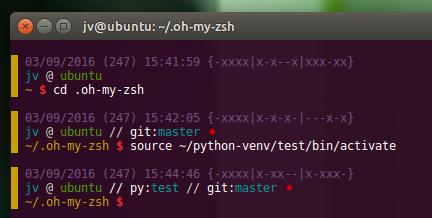

# oh-my-zsh-theme

Personal __Oh My Zsh__ theme.

It's a 3 lines prompt with :
 - current date and time (with binary clock),
 - username and hostname with git/hg/python virtualenv information,
 - current path

## Usage

Copy `j6tron.zsh-theme` into your local __Oh My Zsh__ installation folder (usually `~/.oh-my-zsh`).

In your `.zshrc` file, change `ZSH_THEME` variable with `j6tron` and add `virtualenv` plugin.

